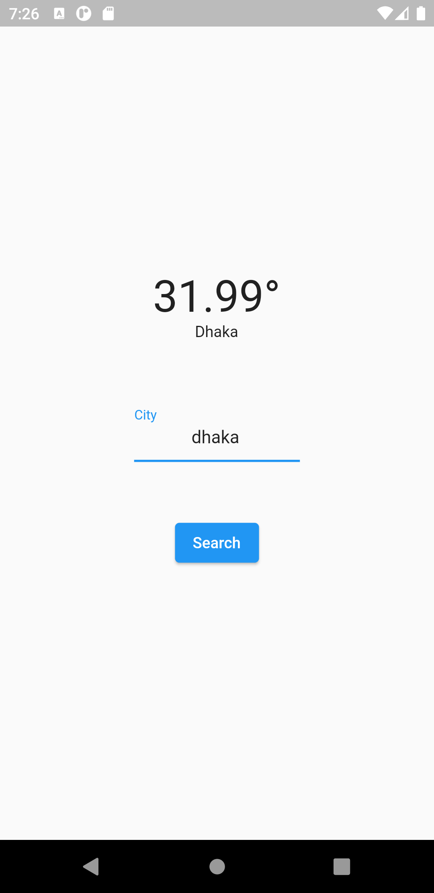

# weather_app

A weather application project.

## Getting Started

This project is a practice Flutter application.

I used openweatherapi for data source for this application : 
- [Open Weather map](https://openweathermap.org/)

## Screenshots
||
|:----:|

